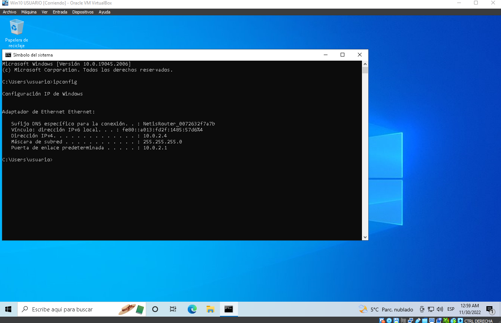

# CONFIGURACIÓN EN RED NAT

Vamos a conectar tres máquinas virtuales dentro de una red NAT en la que tengan conexión a internet y entre ellas.

## INTERFACES

Para ello tenemos que crear una red NAT en el VirtualBox.  
Dentro de VirtualBox --> Archivo --> Herramientas --> Network Manager  
En la nueva ventana, abrimos la pestaña de `NAT Networks` y creamos una nueva red con el nombre que queramos.

Ya tenemos la red NAT creada, ahora hay que asignársela a las tres máquinas.  
Seleccionamos la máquina, abrimos su configuración, dentro de red cambiamos el adaptador 1 de NAT a red NAT y así con todas.

> - Recuerda que deben estar dentro de la misma red NAT, comprueba su nombre.

## CONFIGURACIÓN IP

Vamos a ver la nueva red que le hemos asignado con `ipconfig` y `ifconfig`.

### Windows 10

### Windows Server 2019

### CentOS 7

## RESULTADOS

Haré `ping` a ambas máquinas dentro de cada una y a google.com.

### Windows10

### WindowsServer 2019

### CentOS7

> - Los Windows han necesitado de desactivar el firewall de redes privadas.
> - El CentOS7 no tenia habilitada la tarjeta de red.

## DIAGRAMA DE RED

